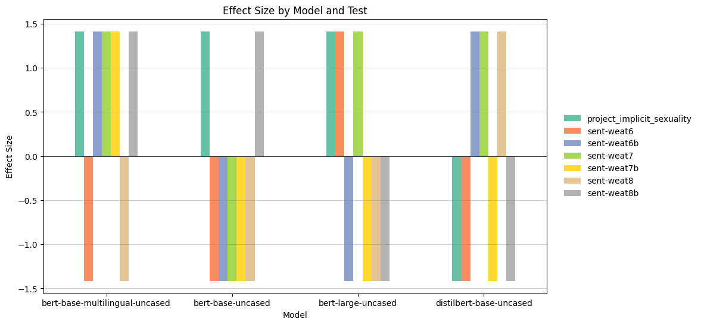

# BERT Bias

This work is based on [sent-bias](https://github.com/W4ngatang/sent-bias).

> This repository contains the code and data for the paper "On Measuring Social Biases in Sentence Encoders" by Chandler May, Alex Wang, Shikha Bordia, Samuel R. Bowman and Rachel Rudinger.

Main changes:
- Focus on BERT:
  ```python
  all_models = [
        "bert-base-uncased",
        "bert-large-uncased",
        "bert-base-multilingual-uncased",
        "distilbert-base-uncased"
    ]
    ```
- Adopt to latest Huggingface Transformers API + library versions (numpy, pandas, etc.)
- Add support for BERT-large

## Setup
Create a virtual environment and install the requirements:
```bash
python3 -m venv venv
source venv/bin/activate
pip install -r requirements.txt
```

## Usage
Run the following command to evaluate the bias of a model on a dataset:
```bash
python3 main.py --model bert-base-uncased --dataset name
```
where `name` is one of the filenames (without .jsonl) in the `data` directory, and `model` is one of the models in the `all_models` list in `main.py`.

## Results
The results are saved in the `results` directory. The results are saved in a csv file with the following columns:
- `model`: the name of the model
- `test`: the name of the test`
- `p-value`: the p-value of the test
- `effect size`: the effect size of the test

<div align="center">

</div>

## License
MIT License (see LICENSE file).